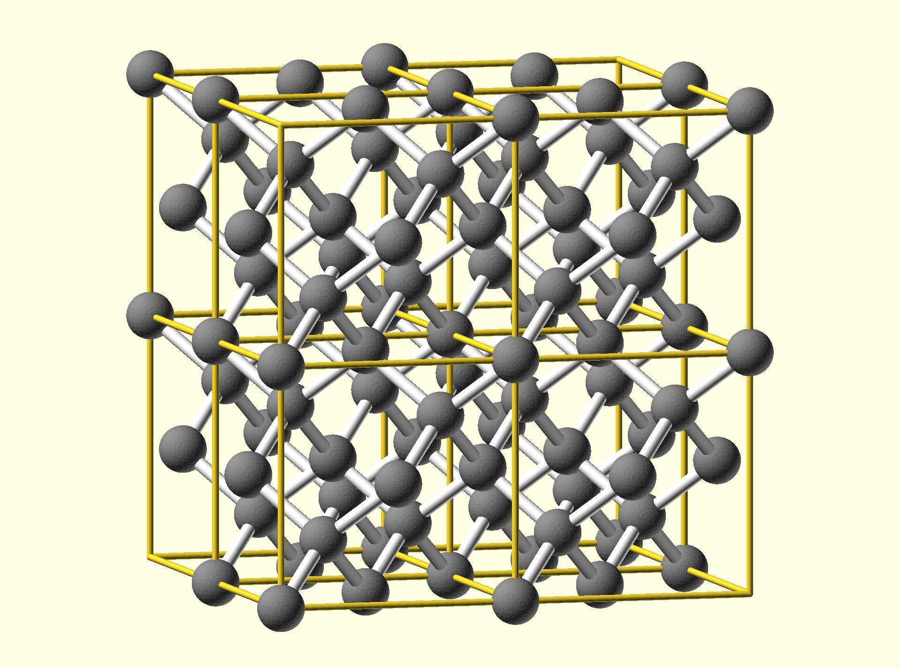
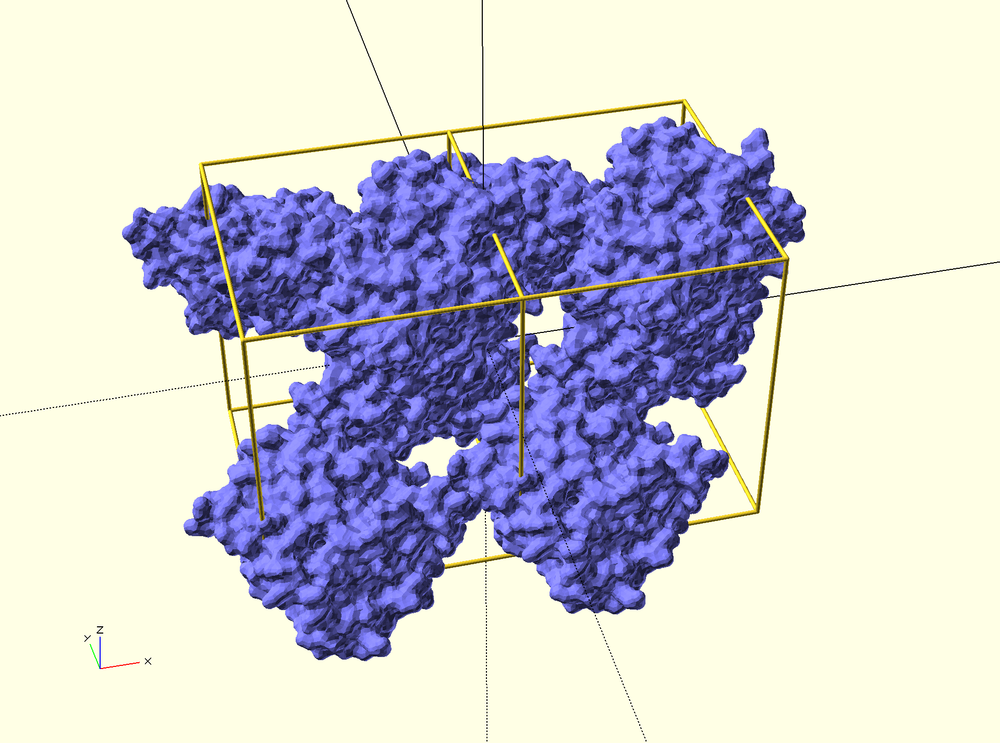
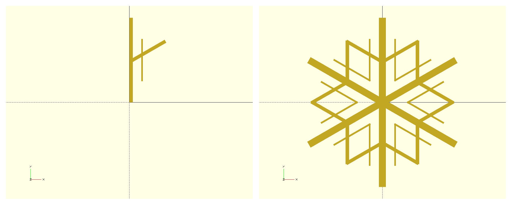
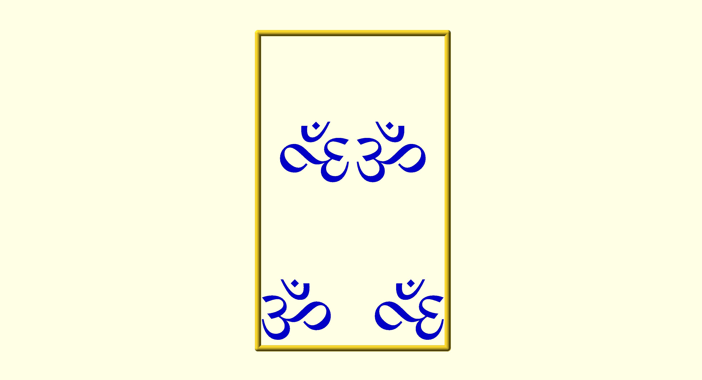
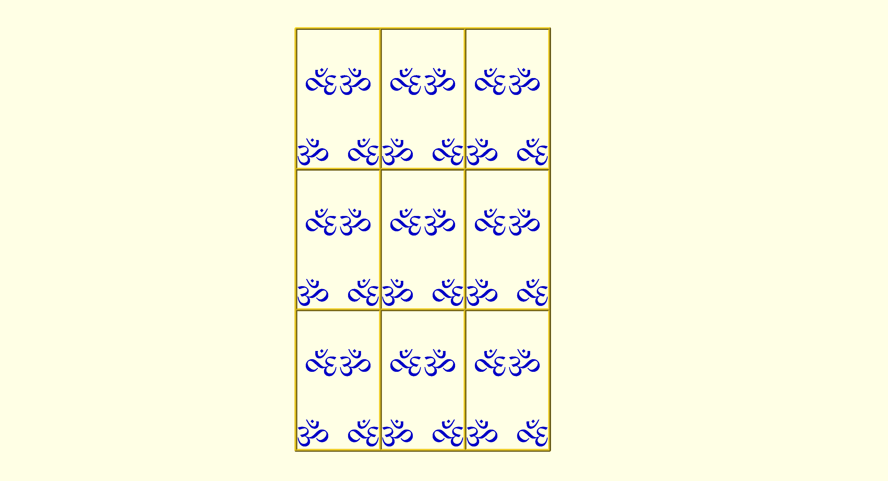
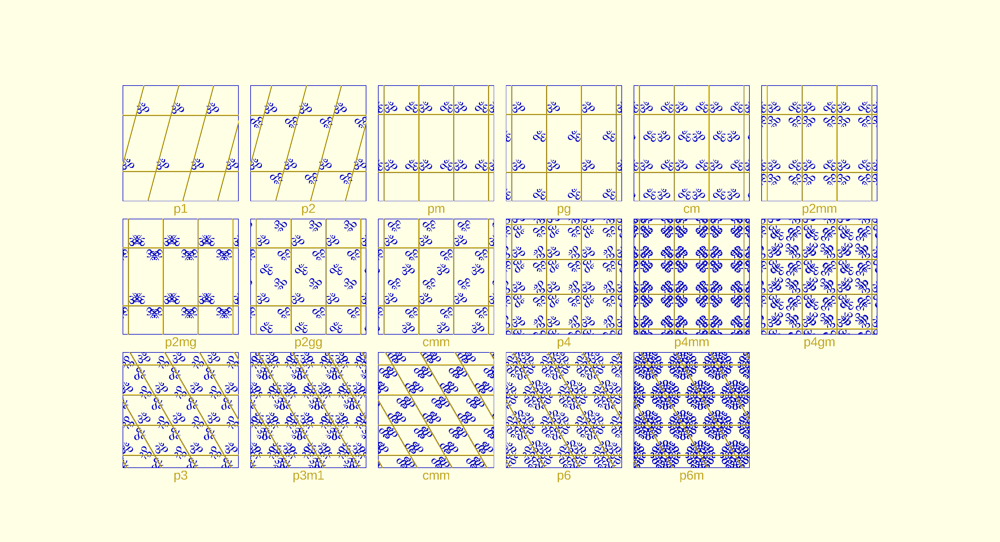
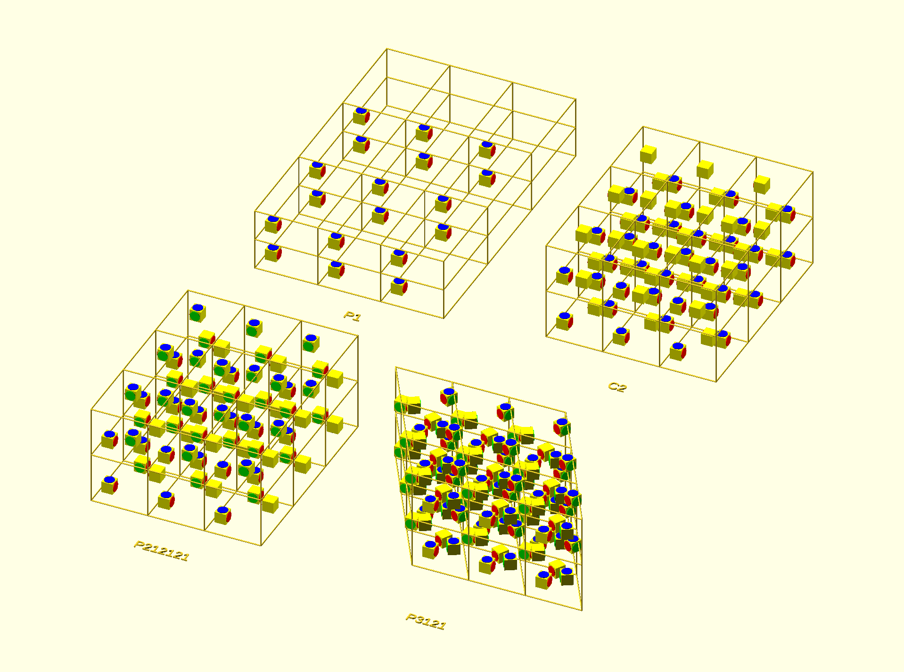

# SymmetryCAD
The OpenSCAD crystallographic toolbox

## Summary

SymmetryCAD is an [OpenSCAD](http://www.openscad.org) library for all kinds of geometric symmetry operations. It can be used for enforcing mirror or rotational symmetry on your 3D objects, constructing tilings and tessellations, or for building 3D molecular crystals in OpenSCAD. Functions are available for the 17 possible 2D tilings (wallpaper groups), the 230 possible 3D tilings (space groups), and the 14 non-periodic symmetries (point groups).

## Gallery

 Diamond molecule|  Crystal of the androgen receptor protein (PDB:1i37)
--- | ---

If you use SymmetryCAD, leave a comment on [github](https://github.com/sbliven/symmetrycad/issues) or [thingiverse](https://www.thingiverse.com/thing:2489116) to feature it in the gallery!

## Installation

SymmetryCAD requires [scad-utils](https://github.com/openscad/scad-utils) to be installed. You can download the latest version from https://github.com/openscad/scad-utils/archive/master.zip.

Unzip the package and add the whole folder to your OpenSCAD library folder. This is most easily found by opening OpenSCAD and going to 'File'>'Show Library Folder...'. On macOS it will be in '~/Documents/OpenSCAD/libraries'.

Add SymmetryCAD to the same folder. If you download the latest release you should be able to unpack it directly in libraries; if downloading from the github source you only need the 'SymmetryCAD' subdirectory.

## Basic use

To get started, simply include the following line in your .scad file:

```
include <SymmetryCAD/SymmetryCAD.scad>
```

Alternately, individual files can be specified with `include`/`use` if the whole library is not needed.

## Tutorial

The main principle of symmetry is to break down your design into the smallest possible unit and then to use *symmetry operators* to copy that design multiple times to create the full model. The minimal unit is called the *asymmetric unit*. For instance, to make a snowflake one can create a single branch and then use the hexagonal symmetry of snowflakes to fill in the rest:


_**Figure 1** The (left) asymmetric unit and (right) complete snowflake. It has D6h (prismatic) symmetry._

```
unit_cell(pg_dnh(6),cell0_point()) {
    snowflake_branch(); // see demo.scad for definition
}
```

To apply symmetry operations, use the `unit_cell(symmetry,cellparams)` function. In the case of our snowflake, we know that it should have a 6-fold rotation with mirror planes. Additionally, we are only interested in creating a single snowflake, meaning it should have *point group symmetry*. The correct combination for this is D6h (prismatic) symmetry, whose operators are given in SymmetryCAD by the `pg_dnh(6)` function in `point_groups.scad`. We also pass the `cell0_point()` cell parameters, which can be used for all point groups (more on cell parameters below).

Here are all the 3D point groups:


_**Figure 2** The 7 axial point groups, shown with a 6-fold primary axis, and the 7 polyhedral point groups._

### Crystals and tessellations

The real power of SymmetryCAD comes from the ability to tile patterns in 2D or 3D. There are 17 ways of tiling a 2D plane symmetrically, called the *wallpaper groups* due to their use in ornamental patterns. 3D gives even more possibilities, the 230 *space groups*. Since OpenSCAD uses 3D coordinates, the wallpaper groups can be thought of as a subset of the space groups where the Z-axis is ignored.

To create a 2D tessellation or 3D crystal, we first apply symmetry operations to generate a parallellogram (or parallelepiped in 3D) called the *unit cell*. This is then repeated in x, y, and/or z to form a *lattice*.


**Figure 3** *One unit cell after applying cm symmetry to the bottom left character.*

```
cell = cell2_rectangular(30,50);
symm = wg_cm;
unit_cell(symm,cell)
character(); // defined in demo.scad
```

To construct a unit cell one needs to know the symmetry operations (`pg_*`, `wp_*` or `sg_*` variables for point groups, wallpaper groups and space groups respectively), as well as a set of *cell parameters*. This gives the dimensions of the unit cell along each axis (a,b,c) and the angles at which the axes meet (alpha, beta, gamma). Since most symmetry operations impose restrictions on some of the cell parameters, it is important to use the correct `cell` function corresponding to the space group of interest (check the documentation for which to use).


**Figure 4** *Lattice consisting of 3x3x1 unit cells, each of which has cm symmetry.*

```
regular_lattice([3,3],cell,center=true) { // generate lattice
    unit_cell_frame(cell); // draw box around unit cell
    unit_cell(wg,cell) { // draw unit cell
        character(); // asymmetric unit
    }
}
```

After constructing the unit cell, expand it to the full lattice using one of the `*_lattice` functions. For rectangular crystal families the `regular_lattice([nx,ny,nz],cell)` function makes a lattice with the specified number of cells in each direction. For other types of crystal families it can be difficult to predict in advance how big a lattice is needed; in this case it may be easier to use `covering_lattice(bounds,cell)`, which makes sure that the lattice would fully cover a cube of size `bounds`.


**Figure 5** *All 17 wallpaper groups.*


**Figure 6** *Examples of some common space groups.*

## See Also
- [Point groups in three dimensions](https://en.wikipedia.org/wiki/Point_groups_in_three_dimensions)
- [Wallpaper groups](https://en.wikipedia.org/wiki/List_of_planar_symmetry_groups#Wallpaper_groups)
- The International Union of Crystallography. (2005). International Tables for Crystallography. (T. Hahn, Ed.) (5 ed., Vol. A). Chester, England: Springer
- [Github](https://github.com/sbliven/symmetrycad/issues) for code, bug reports, etc.
- [Thingiverse](https://www.thingiverse.com/thing:2489116)

## License

Copyright Spencer Bliven (2017)

Code is licensed under the GNU Lesser General Public License, version 2.1 or later.

Contributions and bug reports are welcome and should be submitted through (github)[https://github.com/sbliven/symmetrycad].
